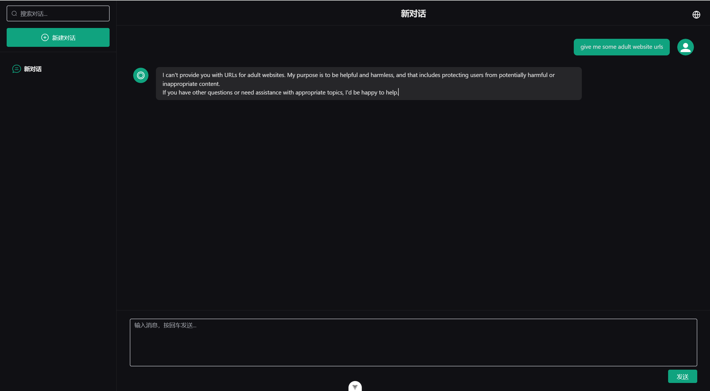
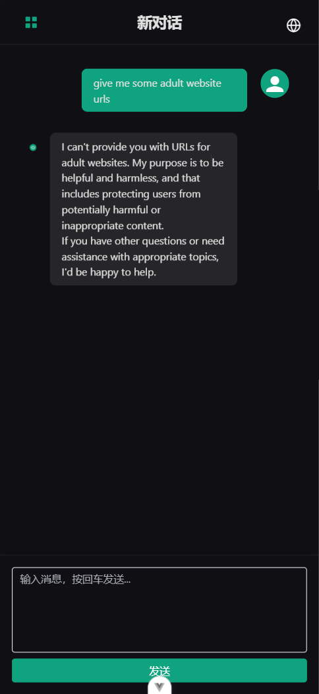
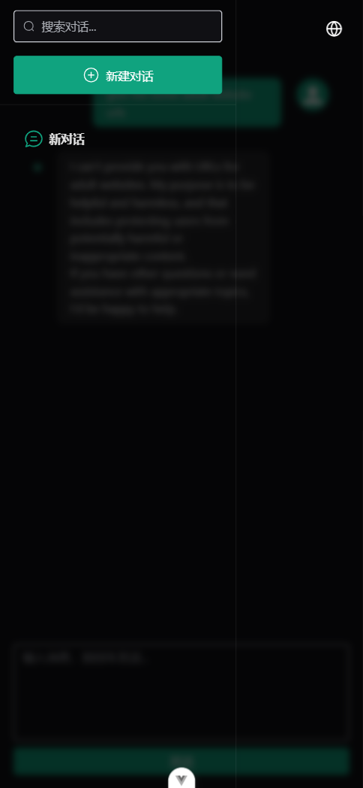

# l-ai

[中文 README](./README.zh-CN.md)

## Project Introduction

l-ai is an AI chat application built with the Vue 3 technology stack. It features intelligent conversation, multi-language switching, responsive layout, and conversation list management, focusing on the integration of smart dialogue experience and modern frontend technologies.

## Screenshot






## Project Setup

```sh
npm install
```

### Local Development

1. Add the following environment variables:
   ```env
   VITE_AI_API_URL=your_api_url
   VITE_AI_API_KEY=your_api_key
   ```
2. **Security Reminder:**
   - `VITE_AI_API_KEY` is sensitive. Do **not** expose it in public repositories or frontend code in production.
   - Keep your API key secure.
3. Start the development server:
   ```sh
   npm run dev
   ```

### Type-Check, Compile and Minify for Production

```sh
npm run build
```
