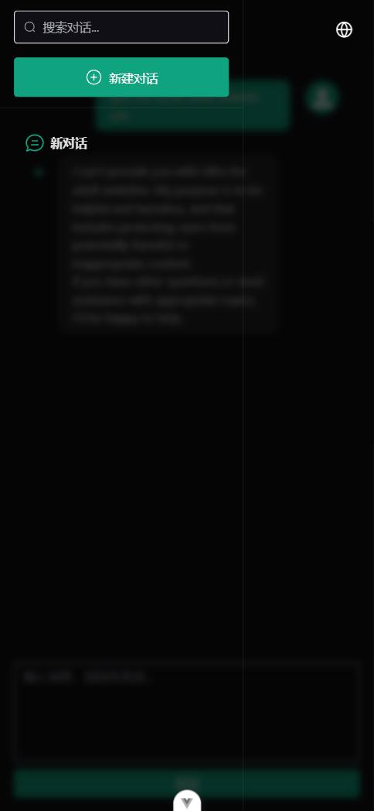

# l-ai

[English README](./README.md)

## 项目简介

l-ai 是一个基于 Vue3 技术栈的 AI 聊天应用，支持多语言切换、响应式布局和会话列表管理，专注于智能对话体验与现代前端技术的结合。

## 项目截图




## 项目安装

```sh
npm install
```

### 本地开发

1. 添加以下环境变量：
   ```env
   VITE_AI_API_URL=你的API地址
   VITE_AI_API_KEY=你的API密钥
   ```
2. **安全提示：**
   - `VITE_AI_API_KEY` 为敏感信息，切勿在生产环境或公共仓库中暴露。
   - 请妥善保管你的 API 密钥。
3. 启动本地开发服务器：
   ```sh
   npm run dev
   ```

### 生产环境构建

```sh
npm run build
```
